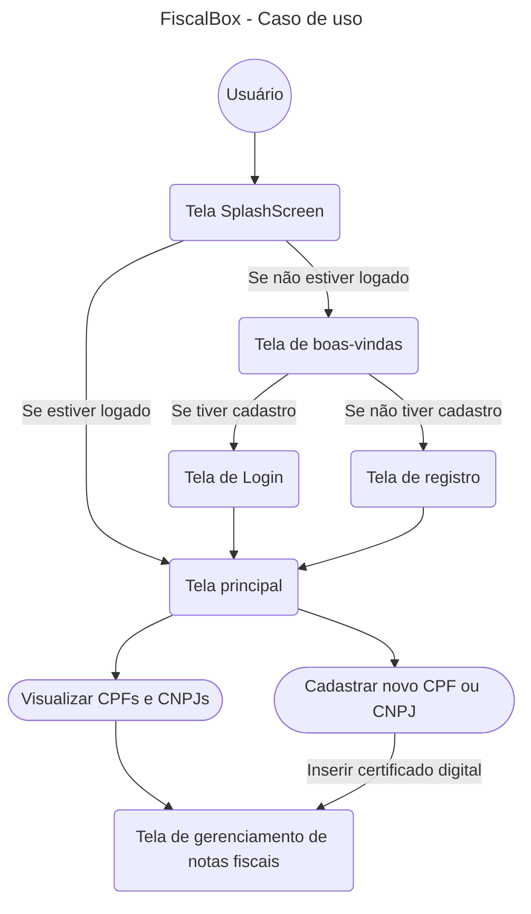

<p align="center">
    
</p>
<h1 align="center">FiscalBox</h1>
<p align="center">Seu controle de notas fiscais.<p>

<br>

## Descrição

Este projeto faz parte do meu portfólio para o curso de Engenharia de Software. O sistema foi criado para atender a uma demanda de usuários que enfrentam dificuldades na visualização, e gerenciamento, de notas fiscais em geral.

<br>

## Objetivo e Funcionalidades

### Objetivo Principal

A aplicação tem como objetivo oferecer uma solução eficiente para organizar e facilitar o acesso a notas fiscais, garantindo mais controle sobre elas. Com uma interface intuitiva e recursos voltados à praticidade.

Ela foi desenvolvida para **facilitar a organização e visualização de notas fiscais eletrônicas (NFes)** de maneira simples, rápida e acessível. Com uma interface intuitiva, o usuário pode **visualizar todas as notas escaneadas** (pela chave de acesso ou QR Code), filtrá-las por diversos atributos e, caso deseje, **enviá-las para a nuvem**, garantindo um backup seguro dos documentos fiscais.

A aplicação foi desenvolvida com uma arquitetura escalável, permitindo posteriormente sua adaptação para desktops com MacOS, Windows e Linux. No entanto, a prioridade foi garantir praticidade para dispositivos móveis, considerando a necessidade dos usuários de acessar as informações de forma rápida e pratica.

### Certificado Digital (e-CPF / e-CNPJ)

Para a correta autenticação e consulta das notas fiscais junto ao SEFAZ, é necessário que o usuário possua um **certificado digital válido do tipo e-CPF ou e-CNPJ**, além de sua respectiva **senha de acesso**.

Pensando na **segurança dos dados sensíveis**, o aplicativo adota uma abordagem local e segura:

- O certificado digital **nunca é enviado para servidores externos**.
- O arquivo e a senha são **armazenados localmente de forma criptografada**, em uma **pasta segura e exclusiva da aplicação**.
- A criptografia utilizada garante que **nenhuma outra aplicação** ou processo externo tenha acesso aos dados sensíveis.

Essa abordagem reforça o compromisso da aplicação com a **privacidade e proteção das informações fiscais dos usuários**.

### Monitoramento em Tempo Real do SEFAZ

Como funcionalidade adicional, o aplicativo realiza a verificação do **status dos servidores da SEFAZ em tempo real**, informando ao usuário se o sistema está:

- ✅ **Operante**
- ⚠️ **Com lentidão**
- ❌ **Inoperante**

Essa funcionalidade é possível graças à integração com o serviço da API pública da [WebmaniaBR](https://monitorsefaz.webmaniabr.com/public-api)

Essa checagem evita tentativas frustradas de consulta em momentos de instabilidade da SEFAZ, otimizando a experiência do usuário.

</br>

## Tecnologias Utilizadas

### **Linguagens e Frameworks**:
- **Dart:** Linguagem principal do aplicativo do projeto.
- **Flutter:** Framework baseado em Dart.

### **Gerenciamento de Estado e Armazenamento Local**:
- **GetX:** Package do Flutter para navegação e gerenciamento de estado reativo.
- **GetStorage:** Package do Flutter para armazenamento leve, temporario e rápido de dados locais.
- **Flutter Secure Storage:** Package do Flutter para armazenamento seguro para dados sensíveis (tokens e certificados digitais).

### **Integrações e Comunicação**
- **HTTP:** Package do Flutter para realização de requisições REST para APIs externas.
- **Supabase:** Backend de serviço para login, sincronização de dados e autenticação de usuários.

### **Testes**
- **flutter_test:** Cobertura de testes unitários do Flutter.

### **Compatibilidade e Portabilidade**
Aplicação testada em:
- **iOS 18.1** (Emulador iPhone 16 Pro Max)
- **Android 13** (Emulador Google Pixel 6 Pro)
- **Android 13** (Samsung S3 - One UI 5.1) 

<br>

## Diagramas

### Diagrama de Caso de Uso

O diagrama representa o fluxo principal de navegação do aplicativo, desde a abertura até a visualização das notas fiscais. O usuário inicia na tela SplashScreen, que verifica se ele está autenticado, se estiver logado, é redirecionado diretamente para a tela principal, caso contrário, é direcionado para a tela de boas-vindas.
Usuários já cadastrados, mas que não estão logados, vão para a tela de login, novos usuários seguem para a tela de registro.
Após o login ou registro, todos os usuários acessam a Tela principal, onde podem: Visualizar os CPFs ou CNPJs cadastrados ou cadastrar um novo CPF ou CNPJ, o que exige a inserção de um certificado digital.
Ambas as opções levam o usuário à tela de gerenciamento de notas fiscais, onde ele pode consultar e acompanhar as notas fiscais.



</br>

## Requisitos

### Requisitos Funcionais:

**RF01:** A aplicação deve permitir o cadastro de usuários.

**RF02:** A aplicação deve permitir o login de usuários cadastrados com autenticação.

**RF03:** A aplicação deve permitir que o usuário delete sua conta.

**RF04:** A aplicação deve permitir que o usuário encerre sua sessão.

**RF05:** A aplicação deve fazer um backup local antes do envio para a nuvem (caso o usuario deseje).

**RF06:** A aplicação deve exportar as notas fiscais para o formato que permita utilização em outros sistemas como ERPs e sistemas de contabilidades (por exemplo).

</br>

### Requisitos Não Funcionais:

**RNF01:** A aplicação deve garantir a segurança dos dados do usuário.

**RNF02:** A aplicação deve ter um bom desempenho na coleta e leitura de dados das notas fiscais.

**RNF03:** A aplicação deve ter uma interface intuitiva e fácil de utilizar.

**RNF04:** A aplicação deve ser modular e bem arquitetada, permitindo atualizações futuras e fácil manutenção.

**RNF05:** A aplicação deve apresentar testes unitários.

**RNF06:** A aplicação deve aumentar o suporte para outros tipos de documentos fiscais, emitidos dentro do território Brasileiro, ou por alguma instituição autorizada pelos mesmos, em breve.

<br>

## Instruções de Uso

### Configuração do Supabase

Para que a aplicação funcione corretamente, é necessário ter uma instância previamente configurada no [Supabase](https://supabase.com/). Essa instância é responsável por gerenciar a autenticação dos usuários, guardar os dados das pastas, e garantir a segurança dos dados durante o uso do sistema.

1 - Criar Conta e Instância no Supabase

O primeiro passo é criar uma conta no Supabase. Após o registro, crie uma nova instância de projeto, que será utilizada para armazenar dados, gerenciar usuários e fornecer a base para as operações de autenticação da aplicação.

2 - Habilitar Autenticação de Usuários

No painel do Supabase, acesse a barra lateral esquerda e clique em **“Authentication”**. Em seguida, habilite a autenticação por e-mail, que é o único método atualmente suportado pela aplicação. 

3 - Criar Estrutura do Banco de Dados de Pastas

Para organizar os dados de pastas da aplicação, será necessário criar a estrutura inicial do banco de dados. No painel do Supabase, clique em **“SQL Editor”** na barra lateral esquerda. No terminal que será exibido, cole e execute o seguinte comando:

```env
create table public.pastas (
  id uuid primary key default uuid_generate_v4(),
  user_id uuid references auth.users(id) on delete cascade,
  tipo text,
  numero text,
  created_at timestamp with time zone default now()
);
```

4 - Configurar Regras de Segurança (RLS) e Políticas de Usuário

Após a criação da estrutura do banco de dados, cole o próximo comando no SQL Editor para configurar as Regras de Segurança em Nível de Linha (RLS) e definir as políticas de acesso de usuários às tabelas.
Esse passo é importante pois essas regras garantem que cada usuário autenticado só tenha acesso aos dados que lhe pertencem, reforçando a segurança e a privacidade das informações armazenadas, mesmo que estejam criptografadas.

```env
-- Ativar RLS na tabela
ALTER TABLE pastas ENABLE ROW LEVEL SECURITY;

-- Política de SELECT
CREATE POLICY "Usuario pode ver suas pastas"
ON pastas
FOR SELECT
USING (user_id = auth.uid());

-- Política de INSERT
CREATE POLICY "Usuario pode inserir suas pastas"
ON pastas
FOR INSERT
WITH CHECK (user_id = auth.uid());

-- Política de UPDATE
CREATE POLICY "Usuario pode atualizar suas pastas"
ON pastas
FOR UPDATE
USING (user_id = auth.uid());

-- Política de DELETE
CREATE POLICY "Usuario pode deletar suas pastas"
ON pastas
FOR DELETE
USING (user_id = auth.uid());
```

### Aplicação Flutter

Após a configuração da instância no Supabase, você precisa ter o [Flutter](https://flutter.dev/) instalado no dispositivo que irá executa-lo, e um emulador, ou dispositivo físico (Android ou IOS) disponível.

Após isso, siga os seguintes passos:

1 - Crie um arquivo `.env` na pasta raíz/root do projeto Flutter com os seguintes dados:

```env
SUPABASE_URL="SUA URL"
SUPABASE_ANON_KEY="SUA CHAVE"
```

2 - Instale as dependências do projeto principal com o comando abaixo:

```bash
flutter pub get
```

3 - Execute o aplicativo com o comando abaixo:

```bash
flutter run
```

## Restrições
A aplicação ainda possui algumas limitações:

1 - Publicação nas Lojas Oficiais.

A aplicação não foi publicada na Play Store nem na App Store devido a custos operacionais e à demanda de manutenção contínua exigida pelas lojas e pela infraestrutura de backend (como servidores e exigências específicas da SEFAZ).

2 - Tipos de Notas Suportadas.

Atualmente, a aplicação não oferece suporte para todos os tipos de documentos fiscais, como, por exemplo, a Nota Fiscal Eletrônica do Produtor Rural (NFP-e), devido a restrições nas consultas oferecidas pelo SEFAZ.

3 - Restrição Geográfica e Certificado Digital.

No momento, a aplicação funciona apenas com notas fiscais emitidas por CNPJs registrados no estado de São Paulo.
Essa limitação ocorre devido à mudança do modo de emissões após a reforma tributaria (Emenda Constitucional 132, de 2023), que limita as consultas de notas fiscais em determinadas por região (a aplicação utiliza o SEFAZ Estadual de São Paulo).
Por esse motivo tambem, foi determinado que, obrigatoriamente, é necessario um certificado digital **eCPF** ou **eCNPJ** para fazer as consultas.

<br>

---
_FiscalBox foi criado por Guilherme Banzati Viana Ribeiro, para o projeto de portifólio de finalização do curso de Engenharia de Software, do Centro Universitario Católica de Santa Catarina._