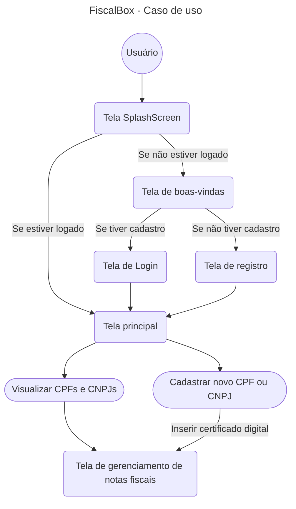

```mermaid
---
title: FiscalBox - Caso de uso
---

flowchart TD
    User((Usuário)) --> SplashScreen(Tela SplashScreen)
    SplashScreen --> |Se estiver logado| HomePage(Tela principal)
    SplashScreen --> |Se não estiver logado| WelcomePage(Tela de boas-vindas)
    WelcomePage --> |Se tiver cadastro| LoginPage(Tela de Login)
    WelcomePage --> |Se não tiver cadastro| RegisterPage(Tela de registro)
    LoginPage --> HomePage
    RegisterPage --> HomePage
    HomePage --> ShowContent([Visualizar CPFs e CNPJs])
    HomePage --> Register([Cadastrar novo CPF ou CNPJ])
    ShowContent --> ViewContent(Tela de gerenciamento de notas fiscais)
    Register --> |Inserir certificado digital| ViewContent
```