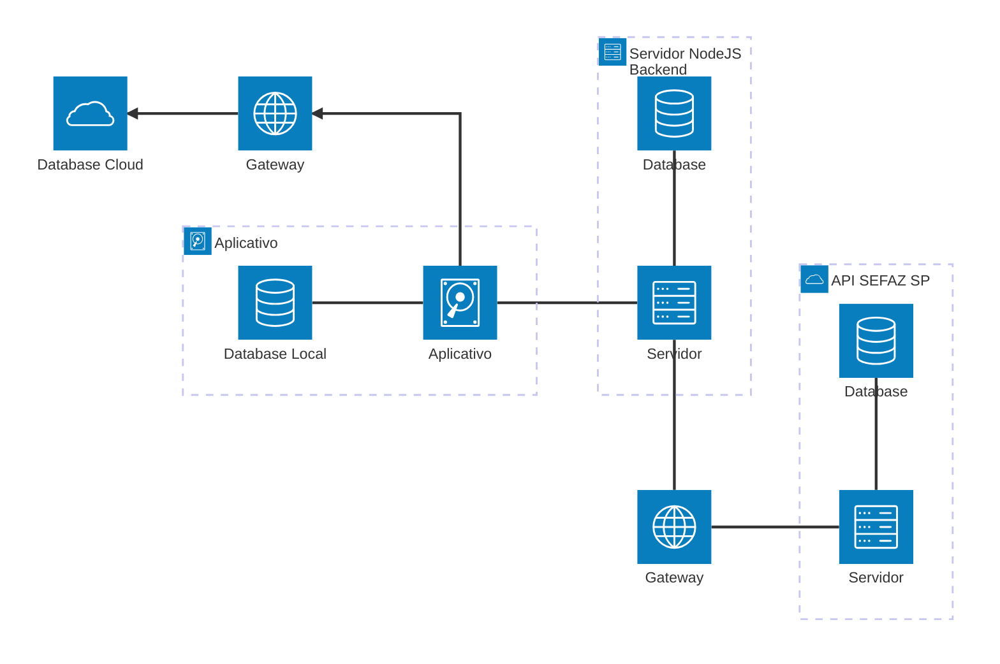

```mermaid
---
title: FiscalBox - Diagrama de arquitetura
---

architecture-beta

service gateway1(internet)[Gateway]
service gateway2(internet)[Gateway]
service DBCloud(cloud)[Database Cloud]

group api_sefaz_sp(cloud)[API SEFAZ SP]
    service DBSefaz(database)[Database] in api_sefaz_sp
    service ServerSefaz(server)[Servidor] in api_sefaz_sp

group backend_NodeJS(server)[Servidor NodeJS Backend]
    service DBNode(database)[Database] in backend_NodeJS
    service ServerNode(server)[Servidor] in backend_NodeJS

group App(disk)[Aplicativo]
    service Aplicativo(disk)[Aplicativo] in App
    service DBAplicativo(database)[Database Local] in App
    
DBAplicativo:R -- L:Aplicativo
Aplicativo:T --> R:gateway2
gateway2:L --> R:DBCloud
gateway1:T -- B:ServerNode
ServerNode:T -- B:DBNode
gateway1:R -- L:ServerSefaz
ServerSefaz:T -- B:DBSefaz
Aplicativo:R -- L:ServerNode
```