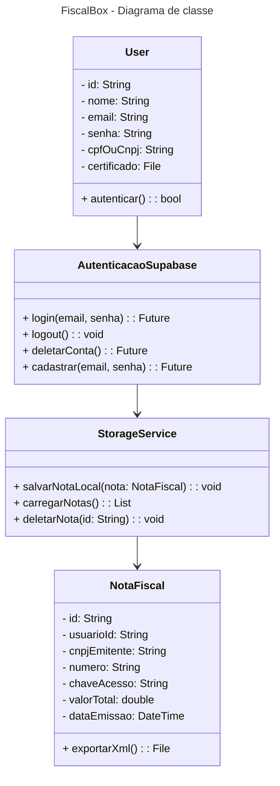

O diagrama de classes do aplicativo FiscalBox representa uma arquitetura, onde o usuário (User) é autenticado via Supabase (AutenticacaoSupabase) e possui um certificado digital para consultas fiscais. As notas fiscais (NotaFiscal) são vinculadas ao usuário e podem ser exportadas em formato XML. O armazenamento local das notas é gerenciado pela classe StorageService, que oferece métodos para salvar, carregar e deletar registros. As classes se conectam de forma hierárquica, refletindo a separação de responsabilidades e facilitando a manutenção e escalabilidade do sistema.